# WildCamTools

Tooling for manipulating wildlife camera clips, in particular using motion detection with lookback on a camera.

## Overview

The idea behind this system is that there is a collection of PoE (power-over-ethernet) cameras deployed to monitor wildlife in an area e.g. a garden, and a central server that efficienctly identifies and stores relevant footage for the future.

PoE cameras over WiFi cameras because of their reliability. PoE cameras over trailcams because of the realtime connection and less maintence.

Many off-the-shelf PoE cameras are intended for security purposes, and therefore prioritize security and cost. As an alternative, Raspberry Pi cameras can be used - for suggestions, see Hardware below.

Camera's running 24/7 capture a _lot_ of footage. Rather than try the impossible task of manually reviewing it, the goal is to have a computer do it. Unfortunatly, that is _very_ difficult - despite the various approaches claiming success, this remains an unsolved problem. So here the aim is to have the computer solve at least part of the problem for us by removing all the footage where nothing happens. 

Generally, humans want footage of cute animals and animals move, so if there's nothing moving in the footage then its probably not interesting enough to keep it. There are multiple motion detection algorithms avaliable, with various tunings and tradeoffs. However, in general by the time something is moving enough to be detected it may have already been on the camera for a while so ideally we want to have clips from just before the motion starts to just after the motion ends. To do that, the system keeps a number of files containing segments of the most recent moments. Those segments can then be combined together when motion is detected to make a complete clip. Those clips can then be archived for manual review at a convenient time (and/or analysed by other -- smarter -- software).

```mermaid
---
config:
  theme: neo-dark
---
architecture-beta
    group picam(material-symbols:video-camera-back)[Pi Camera]

    service camera(material-symbols:camera)[Camera] in picam
    service ffmpeg-camera(simple-icons:ffmpeg)[FFMPEG Camera to RTSP] in picam

    group server(server)[Server]
    service mediamtx[MediaMTX] in server
    service segmenter(simple-icons:ffmpeg)[FFMPEG Segmenter] in server
    service storage-segment(disk)[local segment storage] in server
    service storage-clip(disk)[local segment storage] in server
    service storage-watcher(simple-icons:python)[Storage Watcher] in server
    service motion(simple-icons:python)[Motion] in server
    service mqtt[MQTT] in server

    ffmpeg-camera:L --> R:camera
    ffmpeg-camera:R --> L:mediamtx
    segmenter:B --> T:mediamtx
    segmenter:R --> L:storage-segment
    motion:L --> R:mediamtx
    motion:R --> L:mqtt
    storage-watcher:B --> T:mqtt
    storage-watcher:L --> R:storage-segment
    storage-watcher:T --> B:storage-clip
```

# Hardware

## Camera hardware

My suggestion for a PoE camera is based around Raspberry Pi. These can support PoE, and can have good cameras attached. These are small enough to be installed into off-the-shelf security camera-style casing that is weatherproof, directionally mountable, has a metal shell for heat dissipation, and has a viewing window as well as a cable port. Weatherproof ethernet cable tends mot to be very flexible, so consider a short but flexible cable connected via a coupler within the enclosure.

For encoding, avoid hardware encoders. They tend to have a very low quality to match their low power, which might be okay for security uses but isn't good enough to get nice wildlife clips. H.264 is a widely used codec and has a lower hardware requirement that many others (H.265, VP9, AV1) so a a Pi 3B+ can do 1080p software encoding at full load. For 4k H.264 video, use a Pi 5 - but it doesn't need much memory so the 1GB version should be sufficient. Note that using software encoding will push the power consumption of each camera up significantly from idle, but while a 100% increase sounds a lot if it is 5W to 10W then that's not a problem in a typical PoE scenario. Because the video only needs to go from the camera to the server, it can use a relatively large amount of bandwidth and therefore not need to be heavily compressed which means that the same hardware can produce a better quality image. 

## Server

The server that is processing the camera feeds does not need to be a particularly high powered device, but it does need to be significantly more powerful than the camera(s). As it is also intended to be running 24/7/365 at heavy load, power efficiency is a consideration. Mini PCs (e.g. N150) and laptop CPUs can work well here, particularly when hardware decoding is avaliable and for relatively small numbers of cameras. For generating archival clips, software AV1 encoding is a good way to go; it claims 50% less bits for same quality. As re-encoding at this stage is not real-time, encoding performance is not as critical as on the camera.

Note that if there are a lot of cameras, it is quite possible to split them into groups and have a separate server for each group. These could even be heterogeneous or the work distributed via Kubernates or similar if you want to put the effort in.

---

Repository initiated with [fpgmaas/cookiecutter-uv](https://github.com/fpgmaas/cookiecutter-uv).
