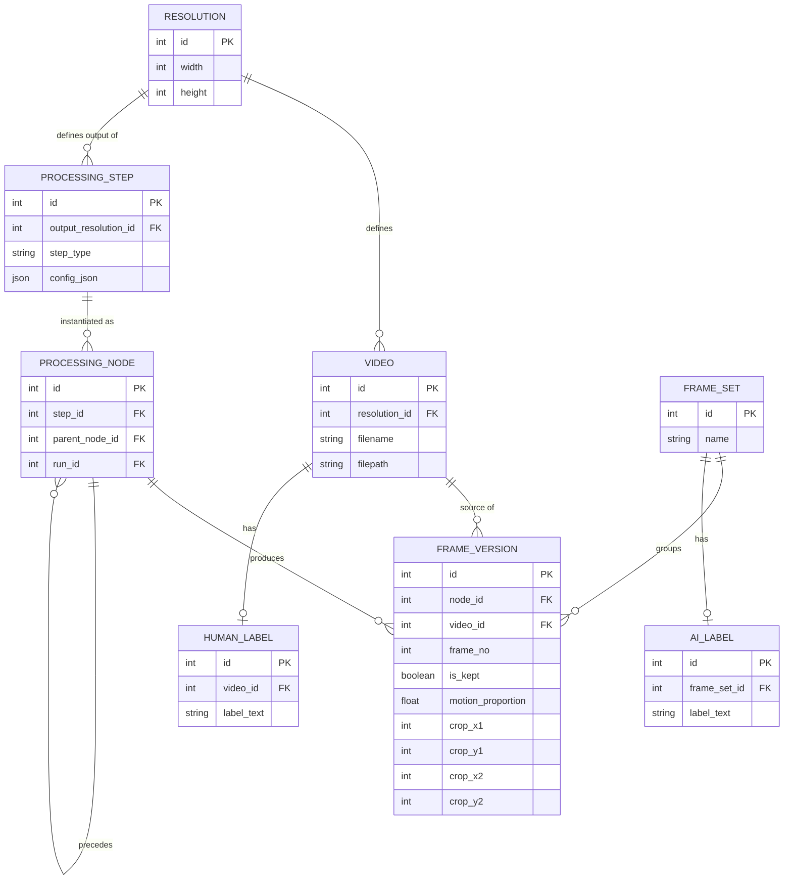

# Project: WildCamTools Persistence Module

## 1. Overview
This module implements a robust, normalized persistence layer for tracking video processing pipelines, frame analysis, and multi-level labeling. It is designed to be database-agnostic, starting with SQLite for local development and providing a seamless migration path to PostgreSQL via an abstraction layer.

## 2. Tech Stack
- **Database**: SQLite (Initially) $\to$ PostgreSQL (Future)
- **ORM/Abstraction**: `SQLModel` (Combines SQLAlchemy and Pydantic)
- **Migrations**: `Alembic`
- **Type Safety**: Python 3.14+ type hints

## 3. Architecture & Rationale

### 3.1 Core Design Principles
- **Provenance**: The system tracks exactly how a raw video became a specific labeled event.
- **Normalization**: Common resolutions and configurations are stored once and referenced via IDs.
- **Sequential Pipeline**: Transformations are modeled as a chain of nodes, allowing for "versioned" frames at different stages of the pipeline.
- **Hierarchical Labeling**: Distinguishes between human labels (video-level context) and AI labels (event-level detection).

### 3.2 Entity Relationship Diagram (ERD)



### 3.3 Data Logic
- **Coordinates**: All crop coordinates are explicit integers relative to the `Resolution` of the producing `ProcessingNode`.
- **Pipeline Flow**: `Video` $\to$ `ProcessingStep` $\to$ `ProcessingNode` $\to$ `FrameVersion`.
- **Event Grouping**: `FrameVersion` $\to$ `FrameSet` $\to$ `AI Label`.

## 4. Implementation Plan

### 4.1 Encapsulation Strategy
To minimize changes to existing logic, all persistence code will be housed in a new submodule: `src/wildcamtools/lib/persistence/`.

### 4.2 Proposed File Structure
```text
src/wildcamtools/lib/persistence/
├── __init__.py
├── database.py       # Engine and Session management
├── models.py         # SQLModel definitions (Resolution, Video, etc.)
├── manager.py        # High-level API (PersistenceManager) for the app
└── migrations/       # Alembic migration scripts
```

### 4.3 Integration Points
- **`lib/vidio.py`**: Video metadata save/lookup.
- **`lib/frames.py`**: Wrap `FrameHandler` chain to record `FrameVersion` and `ProcessingNode` data.
- **`lib/label.py`**: Replace JSONL operations with `Human_Label` and `AI_Label` database calls.
